# 实验 1 OpenFlow 建立连接交互流程学习

## 任务目的

1. 了解 OpenFlow 交换机与 OpenFlow 控制器建立 TCP 连接的过程。
2. 掌握配置安全通道中的 OpenFlow 版本的方法。
3. 掌握 OpenFlow 交换机和 OpenFlow 控制器的消息交互流程。

## 任务环境

| 设备名称 |                       软件环境（镜像）                       |                    硬件环境                    |
| :------: | :----------------------------------------------------------: | :--------------------------------------------: |
|  控制器  | OS: Arch Linux x86_64<br/>Kernel: 5.12.5<br/>Floodlight: 1.2 | CPU: Intel 2 核 @ 1.991GHz<br>Memory: 1980MiB  |
|   主机   | OS: Arch Linux x86_64<br/>Kernel: 5.12.5<br/>Mininet: 2.3.0  | CPU: Intel 2 核 @ 1.991GHz<br/>Memory: 1980MiB |

## 任务内容

1. 配置交换机与控制器，使其支持 OpenFlow1.3。
2. 分析消息包，掌握交换机与控制器的消息交互流程。

## 实验原理

### OpenFlow 协议简介

2006 年，斯坦福大学 Clean Slate 计划资助的 Ethane 项目开始部署，致力于企业网架构的创新，OpenFlow 协议的雏形就诞生于这个项目。2008 年，Nick McKeown 教授的一篇重要论文“OpenFlow：Enabling Innovation in Campus Networks”使得 OpenFlow 正式进入人们的视野，继而成为了标准化组织 ONF（Open Network Foundation，开放网络基金会）主推的南向接口协议。经过多年的发展，OpenFlow 现已成为 SDN 的主流南向接口协议之一。目前，OpenFlow 协议还在不断地演进中，本实验采用 OpenFlow v1.3 协议，并对控制器与 OpenFlow 交换机之间的交互过程进行深入分析。

OpenFlow 主要有 3 种类型的消息，分别是 `Controller-to-Switch`、`Asynchronous` 和 `Symmetric` ，其中每个类型又包含多个子类型。`Controller-to-Switch` 消息由控制器发起，用于管理、查看交换机的状态。Asynchronous 消息由交换机发起，向控制器汇报交换机的事件和改变。 `Symmetric` 消息由控制器或交换机任一方发起，无需请求直接发起消息。详细信息如下表所示：

|        消息类型        |                                             消息例子                                              |                                                                                         描述                                                                                         |
| :--------------------: | :-----------------------------------------------------------------------------------------------: | :----------------------------------------------------------------------------------------------------------------------------------------------------------------------------------: |
| `Controller-to-Switch` | `Packet_out`<br/>`Barrier`<br/>`Switch`<br/>`Configuration`<br/>`Switch Features`<br/>`Multipart` |                    控制器使用这些消息可以添加、修改或删除流表项<br/>查询交换机的功能和统计<br/>配置交换机<br/>配置交换机端口属性<br/>将数据包发送出指定交换机端口                    |
|     `Asynchronous`     |  `Error`<br/>`Packet_in`<br/>`Port Status`<br/>`Table Status`<br/>`Controller Role`<br/>`Status`  | 由交换机发起，发送消息给控制器<br/>这些消息可以是没有匹配交换机中任意流表项的数据包或数据包头，因此需要发送给控制器进行处理<br/>在流状态、端口状态改变，或者产生错误消息时，进行通知 |
|      `Symmetric`       |                               `Hello`<br/>`Echo`<br/>`Experimenter`                               |     `Hello` 消息在控制器与交换机建立连接过程中使用<br/>`Echo` 消息用来确定 `Controller-to-Switch` 连接的延时，验证连接是否处于活跃状态<br/>`Experimenter` 消息用于未来消息的扩展     |

### OpenFlow 连接建立交互流程

在 OpenFlow1.3 协议的情况下，控制器与 OpenFlow 交换机的消息完整交互流程如下：

1. 控制器与 OpenFlow 交换机通过 TCP“三次握手”，建立有效的连接。
2. 控制器与 OpenFlow 交换机之间相互发送 `Hello` 消息，用于协商双方的 OpenFlow 版本号。在双方支持的最高版本号不一致的情况下，协商的结果将以较低的 OpenFlow 版本为准。如果双方协商不一致，还会产生 `Error` 消息。
3. 控制器向 OpenFlow 交换机发送 `Features Request` 消息，请求 OpenFlow 交换机上传自己的详细参数。OpenFlow 交换机收到请求后，向控制器发送 `Features Reply` 消息，详细汇报自身参数，包括支持的 buffer 数目、流表数以及 Actions 等。
4. 控制器通过 `Set Config` 消息下发配置参数，然后通过 `Get config Request` 消息请求 OpenFlow 交换机上传修改后的配置信息。OpenFlow 交换机通过 `Get config Reply` 消息向控制器发送当前的配置信息。
5. 控制器与 OpenFlow 交换机之间发送 `Packet_out` 、 `Packet_in` 消息，通过 `Packet_out` 中内置的 LLDP 包，进行网络拓扑的探测。
6. 控制器与 OpenFlow 交换机之间通过发送 `Multipart Request`、`Mutipart Reply` 消息，控制器能获取 OpenFlow 交换机的状态信息，包括流的信息、端口信息等。
7. 控制器与 OpenFlow 交换机之间通过发送 `Echo Request` 、 `Echo Reply` 消息，保证二者之间存在有效连接，避免失联。

**说明：以上为控制器与 OpenFlow 交换机之间的标准交互流程，在具体实验过程中某些阶段可能会缺失。**

## 实验步骤

### 一、实验环境检查

#### 1. 检查控制器 IP

登录控制器，查看控制器所在主机的 IP 地址。

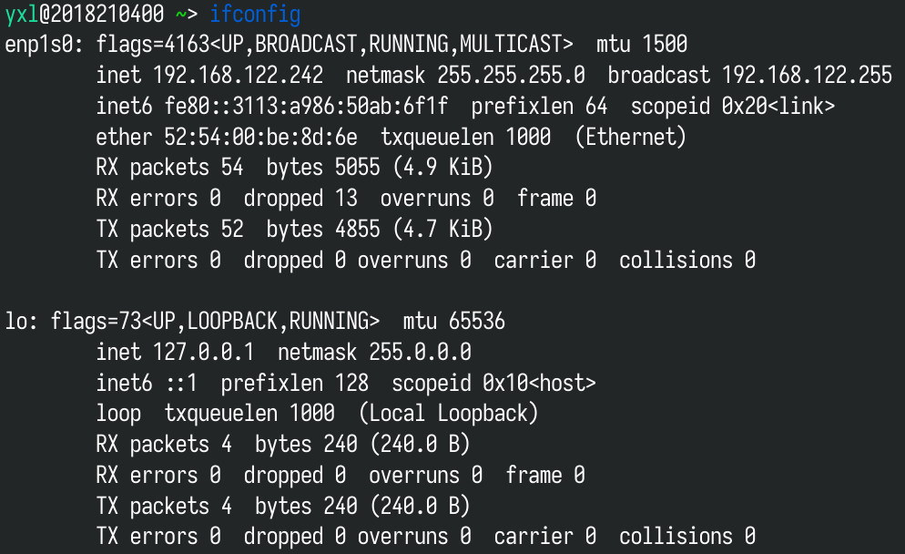
_控制器 IP_

#### 2. 检查主机 IP

登录主机，查看主机的 IP 地址。

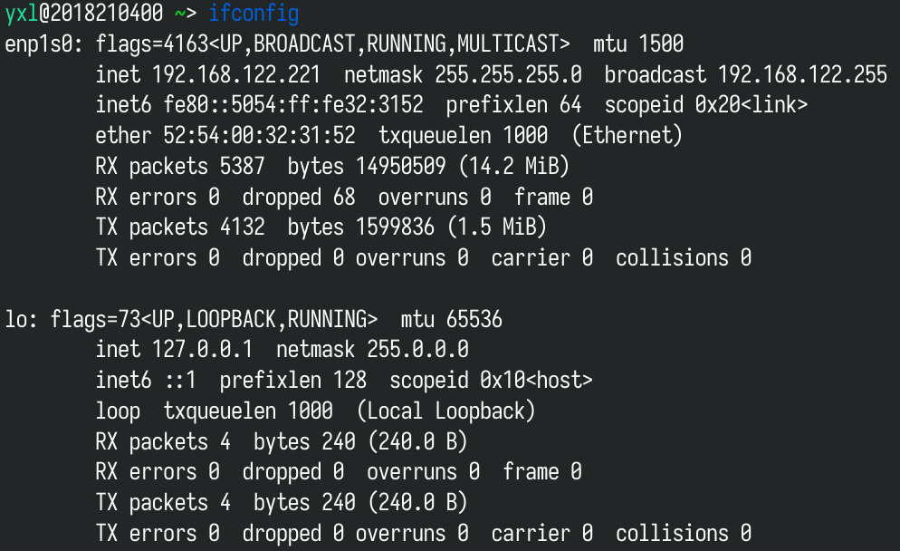
_主机 IP_

### 二、捕获数据包

#### 1. 启动 Floodlight 和 Wireshark

登陆控制器主机，启动 Floodlight，观察到其监听的端口为 `6653` 。

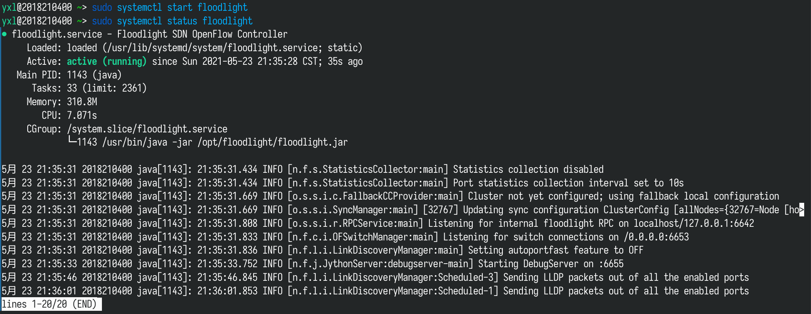
_启动 Floodlight_

接下来执行以下命令启动抓包工具 Wireshark：

```shell
wireshark
```

#### 2. 捕获对应网卡的数据包

选择网卡 `enp1s0` ，Wireshark 将捕获控制器与交换机建立连接过程中的数据包，通过分析这些数据包了解控制器与交换机基于 OpenFlow 协议进行交互的流程。

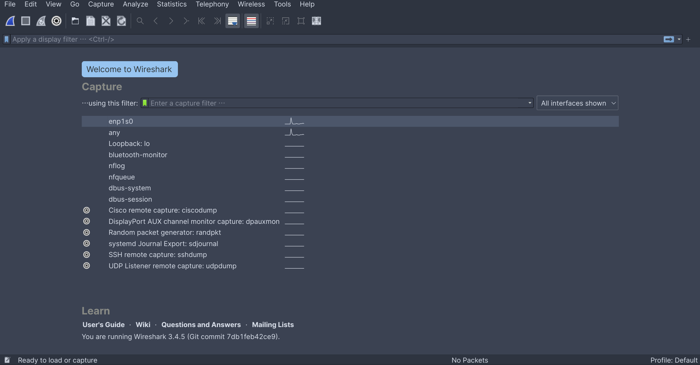
_启动 Wireshark_

#### 3. 启动 Mininet

运行命令 `mn` ，通过 `--controller` 参数设置 Mininet 连接远程控制器，并指定控制器的 IP 为 `192.168.122.242` ，端口号为 `6653` 。

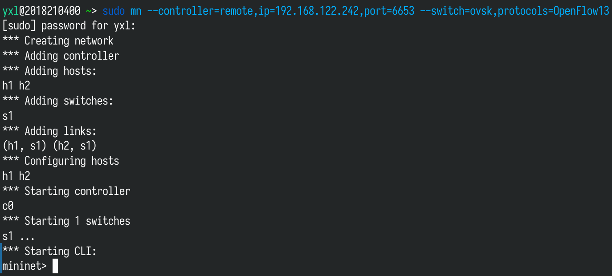
_启动 Mininet_

#### 4. 停止 Wireshark

登录 Floodlight 控制器，停止 Wireshark，观察数据包列表，可以看出控制器与交换机的基本交互流程。

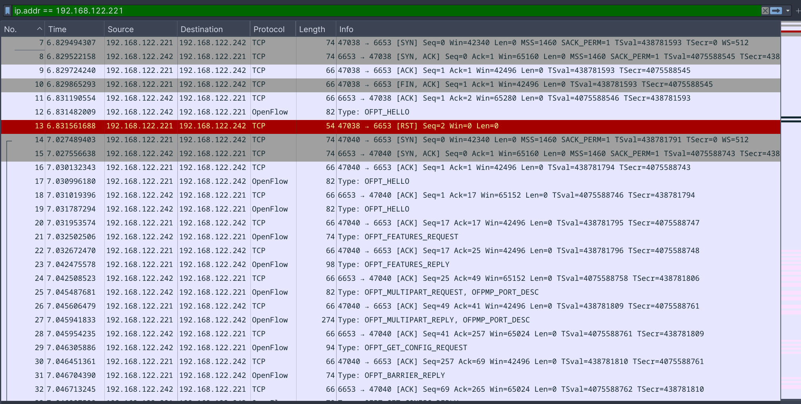
_Wireshark 数据包列表_

### 三、OpenFlow1.3 交互流程分析

#### 1. 建立连接

交换机与控制器经过 3 次握手后,双方建立 TCP 连接。查看捕获到的数据包，分析交换机与控制器建立 TCP 连接的流程。分析 TCP 连接建立过程，需要先了解 TCP 的状态位，主要包括 SYN、FIN、ACK、PSH、RST 和 URG。SYN 表示建立连接，FIN 表示关闭连接，ACK 表示响应，PSH 表示有 DATA 数据传输，RST 表示连接重置。可以看出交换机与控制器经历一次连接重置后，成功完成三次握手，建立 TCP 连接，如下图所示。

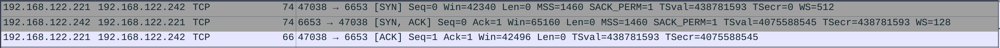

#### 2. 版本协商

当控制器与交换机建立 TCP 连接后，由其中某一方发起 `HELLO` 消息，双方协调协 OpenFlow 议版本号。控制器和交换机都会向对方发送一条 `HELLO` 消息，消息中附上自己支持的 OpenFlow 的最高版本。接收到对方 `HELLO` 消息后，判断自己能否支持对方发送的版本，能支持则版本协商成功，不能支持则回复一条 `OFPT_ERROR` 消息。

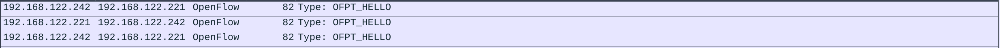

查看 `HELLO` 消息详情，本实验中由于交换机和控制器都能支持 OpenFlow1.3 版本，所以版本协商为 1.3，如下图所示。

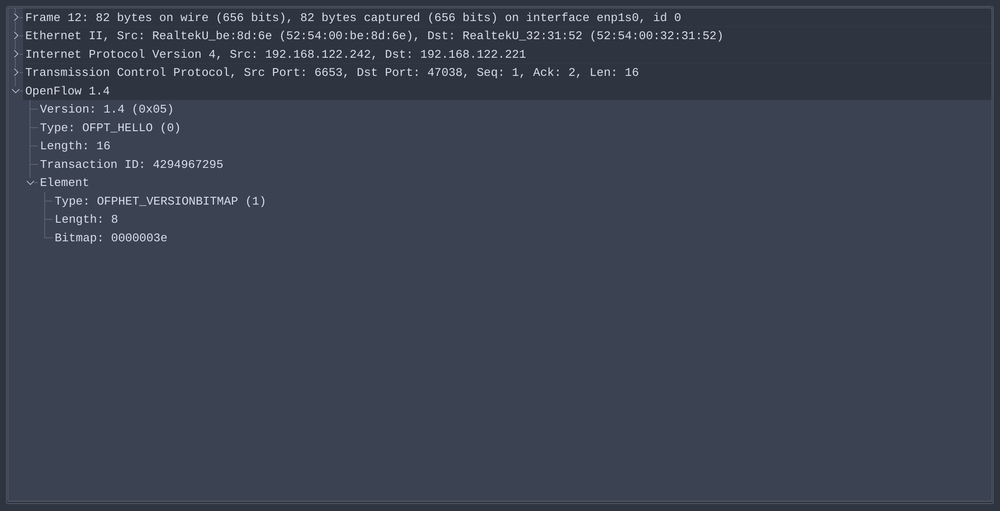
_控制器_

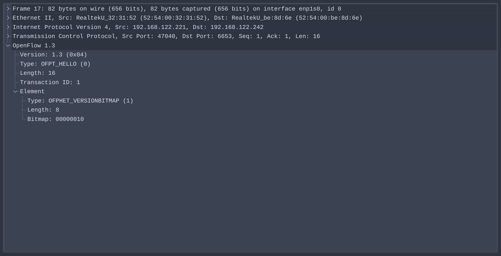
_主机_

#### 3. 请求特性参数

OpenFlow 版本协商完成后，控制器发送一条 `FEATURES_REQUEST` 消息获取交换机的特性信息，包括交换机的 ID（DPID）、缓冲区数量、端口及端口属性等等。相应的，交换机回复 `FEATURES_REPLY` 消息，如下图所示。


`FEATURES_REPLY` 数据包详情如下，交换机的 DPID 是数据通道独一无二的标识符，低 48 位是一个 MAC 地址，高 16 位是自定义的。本实验中交换机缓冲区数量（n_buffers）为 0，交换机支持的流表数量（n_tables）为 254，交换机所支持的功能（capabilities），如下图所示。

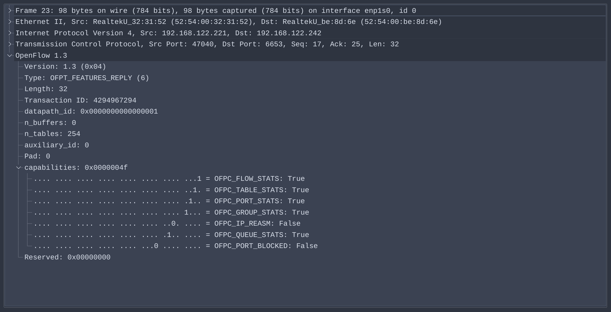

#### 4. 配置参数

控制器通过 `SET_CONFIG` 消息下发配置参数，然后通过 `GET_CONFIG_REQUEST` 消息请求 OpenFlow 交换机上传修改后的配置信息。OpenFlow 交换机通过 `GET_CONFIG_REPLY` 消息向控制器发送当前的配置信息。

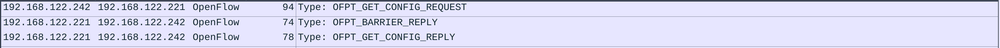

#### 5. 获取交换机信息

OpenFlow1.0 协议中 `FEATURES_REPLY` 消息还包含交换机端口信息，OpenFlow 1.3 协议将 `stats` 框架更名为 `multipart` 框架，并且将端口描述移植到 `multipart` 消息中。其中 `OPPT_PORT_DESC` 类型的 `multipart` 消息就是用于获取交换机端口信息的。

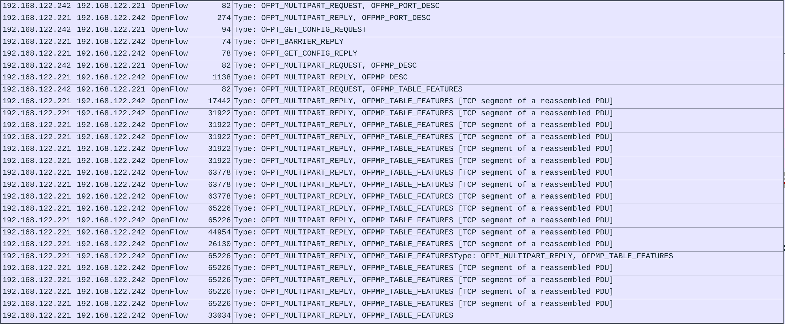

查看 `OPPT_PORT_DESC` 类型 `MULTIPART_REPLY` 消息，消息中列出了交换机的端口以及每个端口的详细信息，包括端口名称和 mac 地址等，如下图所示。

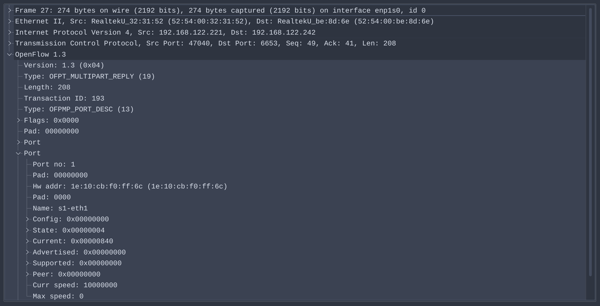

`OFPMP_DESC` 类型的 `MULTIPART_REPLY` 消息包含了交换机的其他信息，包括交换机厂商名称、交换机名称以及交换机版本等。本实验中使用的是 Mininet 仿真软件中自带的开源交换机 `Open vSwitch(2.14.2)`，而 Open vSwitch 是由 Nicira Networks 主导开发的，如下图所示。

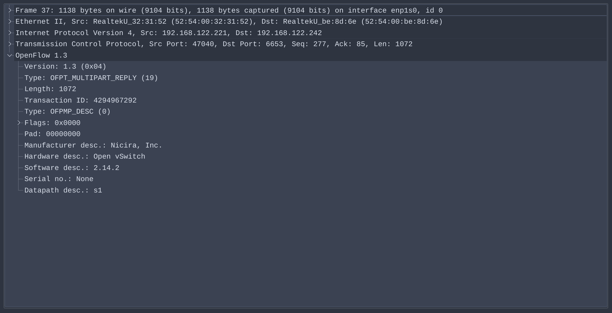

#### 6. 网络拓扑的探测

控制器与 OpenFlow 交换机之间发送 `PACKET_OUT` 、 `PACKET_IN` 消息，通过 `PACKET_OUT` 中内置的 LLDP 包，进行网络拓扑的探测。


#### 7. 确认连接状态

在连接过程中，控制器不断的发送 `ECHO_REQUEST` 消息给交换机，确认交换机与控制器之间的连接状态。相应的，交换机会回复 `ECHO_REPLY` 消息，如下图所示。


