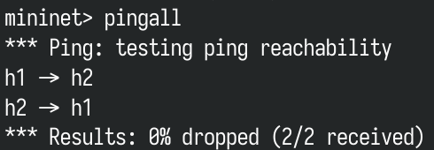
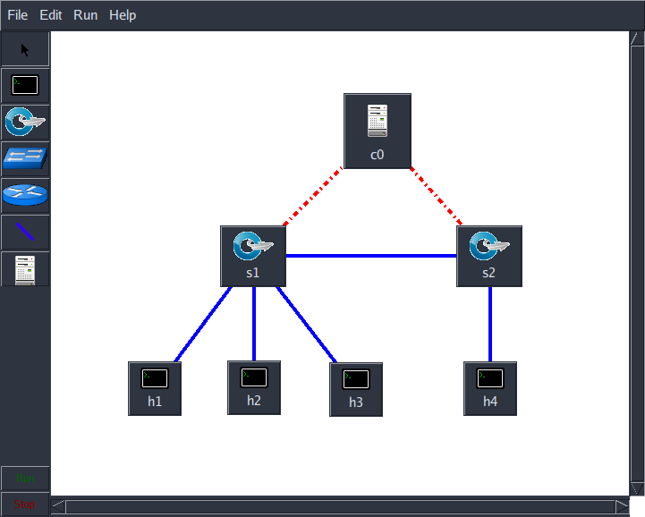

# 实验 2 Mininet 拓扑构建

## 任务目的

1. 了解 Mininet 的命令使用，通过命令模拟创建 SDN 网络；
2. 使用网络构建启动参数、内部交互命令及外部运行参数；
3. 学习 Miniedit 可视化操作，生成 python 拓扑脚本。

## 任务环境

| 设备名称 |                      软件环境（镜像）                       |                    硬件环境                    |
| :------: | :---------------------------------------------------------: | :--------------------------------------------: |
|   主机   | OS: Arch Linux x86_64<br/>Kernel: 5.12.5<br/>Mininet: 2.3.0 | CPU: Intel 2 核 @ 1.991GHz<br/>Memory: 1980MiB |

## 实验原理

### Mininet 简介

Mininet 是基于 Linux Container 架构开发的一个进程虚拟化网络仿真工具，可以创建一个含有主机、交换机、控制器和链路的虚拟网络，其交换机支持 OpenFlow，具有高度灵活的自定义软件定义网络。Mininet 可以用一个命令在一台主机上（虚拟机、云或者本地）以秒级创建一个虚拟网络，并在上面运行真正的内核、交换机和应用程序代码。

Mininet 能实现如下功能：

- 为 OpenFlow 应用程序提供一个简单、便宜的网络测试平台
- 启用复杂的拓扑测试，无需连接物理网络
- 具有拓扑感知和 OpenFlow 感知的 CLI，用于调试或运行网络范围的测试
- 支持任意自定义拓扑，主机数可达 4096，并包括一组基本的参数化拓扑
- 提供用于网络创建和实验的可扩展 Python API

在基于 Mininet 的使用下，可以轻易的在自己的笔记本上测试一个软件定义网络（Software-Defined Networking），对基于 OpenFlow、Open vSwitch 的各种协议等进行开发验证，或者验证自己的想法。且所有的代码几乎可以无缝迁移到真实的硬件环境中，在实验室里，一行命令就可以创建一个支持 SDN 的任意拓扑的网络结构，并可以灵活的进行相关测试，验证了设计的正确后，可以轻松部署到真实的硬件环境中。

### OpenFlow 连接建立交互流程

Miniedit 可视化，直接在界面上编辑任意拓扑，生成 `python` 自定义拓扑脚本，使用 Mininet 可视化界面方便了用户自定义拓扑创建，为不熟悉 `python` 脚本的使用者创造了更简单的环境，界面直观，可操作性强。

Mininet 2.2.0+内置 `miniedit` 。在 `mininet/examples` 下提供 `miniedit.py` 脚本，执行脚本后显示可视化界面，可自定义拓扑及配置属性。

MiniEdit 使用主要分三个步骤：Miniedit 启动 → 自定义创建拓扑，设置设备信息 → 运行拓扑并生成拓扑脚本。

## 实验步骤

### 一、网络构建参数使用

#### 1. --topo 创建 single 拓扑

单一（Single）拓扑指整个网络拓扑中交换机有且只有一个，交换机可以下挂一个或多个主机，如创建一个交换机、3 个主机，3 个主机都下挂在此一个交换机下：

```shell
sudo mn --topo=single,3
```


#### 2. --topo 创建 linear 拓扑

```shell
sudo mn --topo=linear,3
```


#### 3. --topo 创建 tree 拓扑

树形（tree）拓扑指交换机连接成树形排列，且每个交换机所连接主机一般有多个

关联使用参数 depth 及 fanout，如创建 depth 为 2，fanout 为 3 的拓扑，表示交换机深度即层数为 2，每个交换机下挂 3 个设备：

```shell
sudo mn --topo=tree,depth=2,fanout=3
```


#### 4. --custom 创建自定义拓扑

自定义（custom）拓扑指编写文件 file.py，执行此脚本即可创建定义的拓扑，如在 custom 目录下存在 topo-2sw-2host.py 文件，调用此文件构建拓扑：

```shell
sudo mn --custom mininet/custom/topo-2sw-2host.py
```


### 二、内部交互命令使用

直接通过 mn 默认创建网络，使用一系列命令查看并验证网络系统的链路健壮性。

#### 1. 通过 net 命令显示链接信息


#### 2. 通过 nodes 命令查看节点信息


#### 3. 通过 links 查看链路健壮性信息


#### 4. 通过 pingall 验证所有主机间通信并查看结果



#### 5. 通过 dump 命令可以看出，交换机通过远程方式连接到控制器，且能看到控制器的 IP 和 PORT


#### 6. 通过 quit 退出 Mininet


### 三、Mininet 可视化构建网络拓扑

#### 1. 启动 MiniEdit

```shell
sudo python mininet/examples/miniedit.py
```


#### 2. Miniedit 拓扑建立

选择左侧的网络组件，在空白区域单击鼠标左键即可添加网络组件，可选择的组件主要有主机、OpenFlow 交换机、传统交换机，传统路由器、链路、控制器。


#### 3. Miniedit 属性配置

设备及链路上可进行鼠标右击长按，选择 Properties 即可对其进行配置。

在控制器上进行鼠标右击长按，选择 Properties 即可对控制器进行配置：


在交换机上进行鼠标右击长按，选择 Properties 即可对交换机进行配置，交换机属性需配置 16 位的 DPID：


在主机上进行鼠标右击长按，选择 Properties 即可对主机进行配置，主机属性需配置 IP 地址：


设备属性配置 OK 后，将会在 miniedit.py 执行的后台产生日志，告知所添加的设备属性：


#### 4. Miniedit 全局配置

Miniedit 左上角“Edit”中可以剪切删除设备，及对整个网络进行全局配置：


#### 5. Miniedit 运行

点击左下角“run”，即可运行设置好的网络拓扑，同时在后台可以看到相应的配置信息。运行后对交换机、主机进行右击长按，可查看交换机的 bridge 信息及打开 Host 的终端，交换机信息如下：


#### 6. Miniedit 保存脚本

Miniedit 设置好拓扑后，可通过选择 File-Export Level 2 Script，将其保存为 python 脚本。


#### 7. Miniedit 脚本执行

执行以下命令：

```shell
sudo python mininet/sdnlab.py
```


### 四、创建自定义拓扑

自定义拓扑代码：

```python
from mininet.topo import Topo


class MyTopo( Topo ):
    "Simple topology example."

    def build( self ):
        "Create custom topo."

        sw1 = self.addSwitch( 's1' )
        sw2 = self.addSwitch( 's2' )

        host1 = self.addHost( 'h1' )
        host2 = self.addHost( 'h2' )
        host3 = self.addHost( 'h3' )
        host4 = self.addHost( 'h4' )

        self.addLink( sw2, sw1 )

        self.addLink( sw1, host1 )
        self.addLink( sw1, host2 )
        self.addLink( sw1, host3 )

        self.addLink( sw2, host4 )


topos = { 'mytopo': ( lambda: MyTopo() ) }

```

拓扑结构图：



使用 Mininet 构建网络：


