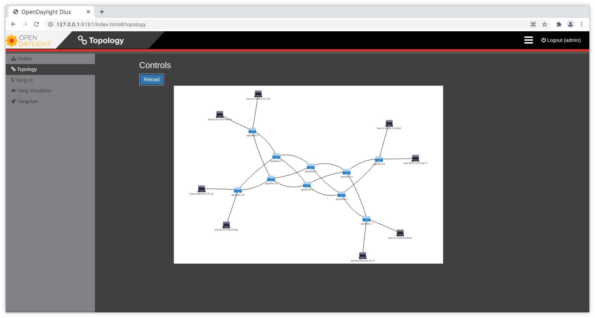
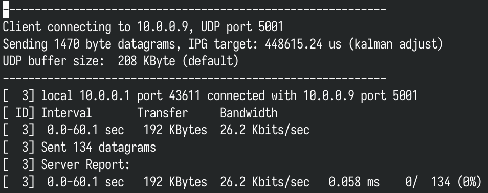

# 实验 3 Mininet 多数据中心网络拓扑流量带宽实验

## 任务目的

1. 通过 Mininet 模拟搭建基于不同数据中心的网络拓扑；
2. 掌握多数据中心网络拓扑的构建；
3. 熟悉网络性能测试工具 Iperf，根据实验测试 SDN 网络的性能；
4. 通过程序生成真实网络流量。

## 任务环境

| 设备名称 |                            软件环境（镜像）                             |                    硬件环境                    |
| :------: | :---------------------------------------------------------------------: | :--------------------------------------------: |
|  控制器  | OS: Arch Linux x86_64<br/>Kernel: 5.12.5<br/>OpenDaylight: 0.6.4 Carbon | CPU: Intel 4 核 @ 1.991GHz<br>Memory: 1980MiB  |
|   主机   |       OS: Arch Linux x86_64<br/>Kernel: 5.12.5<br/>Mininet: 2.3.0       | CPU: Intel 2 核 @ 1.991GHz<br/>Memory: 3929MiB |

## 实验原理

使用 Mininet 中的 `iperf` 工具在网络中生成 UDP 流量，`iperf` 客户端传送数据流到 `iperf` 的服务端，由服务端接收并记录相关信息。网络性能评估中一个巨大的挑战就是如何生成真实的网络流量，可以通过程序来创造人工的网络流量，通过建立测试环境来模拟真实的状况。此应用主要以数据中心网络为目标场景，在 Mininet 仿真环境中尽可能地还原数据中心内部的真实流量情况。

Mininet 数据中心应用价值：

- 树状拓扑结构容错能力强
- 降低数据中心成本消耗
- 提供重新排列的全带宽无阻碍路径
- 提高带宽利用率
- 分析数据中心网络流量性能
- 为真实数据中心和仿真测试床提供有用信息

在 Mininet 中进行自定义命令 iperfmulti 功能拓展主要分为 4 步：

1. 修改 `mininet/net.py`
2. 修改 `mininet/cli.py`
3. 修改 `bin/mn`
4. 重新安装 Mininet 核心文件：`~/mininet/util/install.sh -n`

## 实验步骤

### 一、实现 iperfmulti 功能生成多客户端随机产生 UDP 流量

#### 1. 修改 net.py，添加 iperfSingle 和 iperfMulti

登录 Mininet 所在虚机，编辑在 Mininet 目录下 `mininet/net.py` 文件。

首先定义 `iperfSingle` 函数——在两个主机间进行 `iperf` udp 测试，并且在 server 端记录。之后定义 `iperfMulti`——依次为每一台主机随机选择另一台主机作为 `iperf` 的服务器端，通过调用 `iperfSingle`,自身以客户端身份按照指定参数发送 UDP 流，服务器生成的报告以重定向的方式输出到文件中，使用 `iperfmulti` 命令，主机随机地向另一台主机发起一条恒定带宽的 UDP 数据流：

```diff
--- a/mininet/net.py
+++ b/mininet/net.py
@@ -848,6 +848,49 @@ def iperf( self, hosts=None, l4Type='TCP', udpBw='10M', fmt=None,
         output( '*** Results: %s\n' % result )
         return result

+    def iperfSingle( self, hosts=None, udpBw='10M', period=60, port=5001 ):
+        """Run iperf between two hosts using UDP.
+           hosts: list of hosts; if None, uses opposite hosts
+           returns: results two-element array of server and client speeds"""
+        if not hosts:
+            return
+        else:
+            assert len( hosts ) == 2
+        client, server = hosts
+        filename = client.name[ 1: ] + '.out'
+        output( '*** Iperf: testing bandwidth between ' )
+        output( "%s and %s\n" % ( client.name, server.name ) )
+        iperfArgs = 'iperf -u '
+        bwArgs = '-b ' + udpBw + ' '
+        print( "***start server***" )
+        server.cmd( iperfArgs + '-s -i 1' + ' > ./' + filename + '&' )
+        print( "***start client***" )
+        client.cmd(
+            iperfArgs + '-t ' + str( period ) + ' -c ' +
+            server.IP() + ' ' + bwArgs
+            + ' > ./' + 'client' + filename + '&' )
+
+    def iperfMulti( self, bw, period=60 ):
+        basePort = 5001
+        serverList = []
+        hostList = []
+        hostList = [ h for h in self.hosts ]
+
+        _len = len( hostList )
+        for i in range( 0, _len ):
+            client = hostList[ i ]
+            server = client
+            while( server == client ):
+                server = random.choice( hostList )
+            serverList.append( server )
+            self.iperfSingle( hosts=[ client, server ],
+                             udpBw=bw, period=period, port=basePort )
+            sleep( .05 )
+            basePort += 1
+
+        sleep( period )
+        print( "test has done" )
+
     def runCpuLimitTest( self, cpu, duration=5 ):
         """run CPU limit test with 'while true' processes.
         cpu: desired CPU fraction of each host
```

#### 2. 在 cli.py 中注册 iperfmulti 命令

解析用户输入的命令，`net.py` 定义的 `iperfmulti` 命令需要在 CLI 类中注册这条自定义命令。

```diff
--- a/mininet/cli.py
+++ b/mininet/cli.py
@@ -264,6 +264,21 @@ def do_iperfudp( self, line ):
             error( 'invalid number of args: iperfudp bw src dst\n' +
                    'bw examples: 10M\n' )

+    def do_iperfmulti( self, line ):
+        "Multi iperf UDP test between nodes"
+        args = line.split()
+        if len( args ) == 1:
+            udpBw = args[ 0 ]
+            self.mn.iperfMulti( udpBw )
+        elif len( args ) == 2:
+            udpBw = args[ 0 ]
+            period = args[ 1 ]
+            err = False
+            self.mn.iperfMulti( udpBw, float( period ) )
+        else:
+            error( 'invalid number of args: iperfmulti udpBw period\n' +
+                  'udpBw examples: 1M 120\n' )
+
     def do_intfs( self, _line ):
         "List interfaces."
         for node in self.mn.values():
```

#### 3. 在 bin/mn 中加入 iperfmulti 可执行命令

将 `iperfmulti` 加入到对应的列表中。

```diff
--- a/bin/mn
+++ b/bin/mn
@@ -114,7 +114,7 @@ TESTS.update( all=allTest, none=nullTest, build=nullTest )

 # Map to alternate spellings of Mininet() methods
 ALTSPELLING = { 'pingall': 'pingAll', 'pingpair': 'pingPair',
-                'iperfudp': 'iperfUdp' }
+                'iperfudp': 'iperfUdp', 'iperfmulti': 'iperfMulti' }

 def runTests( mn, options ):
     """Run tests
```

#### 4. 重新编译 Mininet

重新编译安装 Mininet：

```shell
~/mininet/util/install.sh -n
```

#### 5. 验证修改

重新创建网络，输入 `iperf`，可用 table 补全 `iperfmulti`，从而可使用 `iperfmulti` 进行流量随机模型的测试：


### 二、多数据中心拓扑创建脚本编写

通过 python 脚本自定义拓扑，创建包含两个数据中心的网络拓扑：

```python
"""Custom topology example

Adding the 'topos' dict with a key/value pair to generate our newly defined

topology enables one to pass in '--topo=mytopo' from the command line.

"""

from mininet.topo import Topo


class MyTopo( Topo ):
    "Simple topology example."

    def build( self ):
        "Create custom topo."

        # Initialize topology
        L1 = 2
        L2 = L1 * 2
        L3 = L2
        c = []
        a = []
        e = []

        # add core ovs
        for i in range( L1 ):
            sw = self.addSwitch( 'c{}'.format( i + 1 ) )
            c.append( sw )

        # add aggregation ovs
        for i in range( L2 ):
            sw = self.addSwitch( 'a{}'.format( L1 + i + 1 ) )
            a.append( sw )

        # add edge ovs
        for i in range( L3 ):
            sw = self.addSwitch( 'e{}'.format( L1 + L2 + i + 1 ) )
            e.append( sw )

        # add links between core and aggregation ovs
        for i in range( L1 ):
            sw1 = c[ i ]
            for sw2 in a[ int( i/2 )::int( L1/2 ) ]:
                self.addLink( sw2, sw1 )

        # add links between aggregation and edge ovs
        for i in range( 0, L2, 2 ):
            for sw1 in a[ i:i+2 ]:
                for sw2 in e[ i:i+2 ]:
                    self.addLink( sw2, sw1 )

        # add hosts and its links with edge ovs
        count = 1
        for sw1 in e:
            for i in range( 2 ):
                host = self.addHost( 'h{}'.format( count ) )
                self.addLink( sw1, host )
                count += 1


topos = { 'mytopo': ( lambda: MyTopo() ) }

```

备注：Mininet 创建网络拓扑的代码中，可以通过改变代码中定义的 L1 变量来设置核心交换机的数量，并通过添加额外的交换机和链路来构成更复杂的数据中心网络拓扑。随着边缘交换机的增加，主机个数也随之增长，利用 Mininet 的易用性和扩展性，可以创建基于多种数据中心场景下的网络拓扑，达到更好更全面的实验效果。

### 三、数据中心拓扑脚本执行

#### 1. 启动 ODL 控制器


#### 2. 启动 Mininet，生成测试拓扑结构

```shell
sudo mn --custom mininet/custom/fattree.py --topo mytopo --controller=remote,ip=192.168.100.221,port=6653 --switch=ovsk,protocols=OpenFlow13
```


#### 3. 验证主机间的连通性


#### 4. 查看 ODL 控制器 Web 页面拓扑

进入 `http://127.0.0.1:8181/index.html`，用户名： `admin`，密码： `admin`



### 四、数据中心拓扑网络测试——TCP 带宽测试

#### 1. 同一交换机内部的主机间连通性及通信带宽测试

在 h1 和 h2 之间进行 `iperf` 操作进行测试：


#### 2. 相同汇聚交换机下不同机架的主机间测试

在 h1 和 h3 之间进行 `iperf` 操作进行测试：


#### 3. 相同核心交换机不同汇聚交换机下的主机间测试

在 h1 和 h5 之间进行 `iperf` 操作进行测试：


### 五、数据中心拓扑网络测——iperfmulti UDP 测试

#### 1. 进行测试

在 Mininet 中执行 `iperfmulti` 命令，设置带宽参数为 0.025M，我们将能看到 8 台主机随机地向另外一台主机发送数据包。


#### 2. 查看日志

查看下的数据记录，如下所示：


打开服务端数据记录：


打开客户端数据记录：


### 六、自定义拓扑测试

自定义拓扑代码：

```python
from mininet.topo import Topo


class MyTopo( Topo ):
    def build( self ):
        sw1 = self.addSwitch( 'c1' )
        sw2 = self.addSwitch( 'c2' )
        sw3 = self.addSwitch( 'c3' )

        sw4 = self.addSwitch( 'a4' )
        sw5 = self.addSwitch( 'a5' )
        sw6 = self.addSwitch( 'a6' )
        sw7 = self.addSwitch( 'a7' )
        sw8 = self.addSwitch( 'a8' )
        sw9 = self.addSwitch( 'a9' )

        sw10 = self.addSwitch( 'e10' )
        sw11 = self.addSwitch( 'e11' )
        sw12 = self.addSwitch( 'e12' )
        sw13 = self.addSwitch( 'e13' )
        sw14 = self.addSwitch( 'e14' )
        sw15 = self.addSwitch( 'e15' )

        self.addLink( sw4, sw1 )
        self.addLink( sw4, sw2 )
        self.addLink( sw5, sw1 )
        self.addLink( sw5, sw2 )
        self.addLink( sw5, sw3 )
        self.addLink( sw6, sw1 )
        self.addLink( sw6, sw2 )
        self.addLink( sw6, sw3 )
        self.addLink( sw7, sw1 )
        self.addLink( sw7, sw2 )
        self.addLink( sw7, sw3 )
        self.addLink( sw8, sw1 )
        self.addLink( sw8, sw2 )
        self.addLink( sw8, sw3 )
        self.addLink( sw9, sw1 )
        self.addLink( sw9, sw2 )
        self.addLink( sw9, sw3 )

        self.addLink( sw10, sw4 )
        self.addLink( sw10, sw5 )
        self.addLink( sw11, sw4 )
        self.addLink( sw11, sw5 )
        self.addLink( sw12, sw6 )
        self.addLink( sw12, sw7 )
        self.addLink( sw13, sw6 )
        self.addLink( sw13, sw7 )
        self.addLink( sw14, sw8 )
        self.addLink( sw14, sw9 )
        self.addLink( sw15, sw8 )
        self.addLink( sw15, sw9 )

        count = 1
        for sw in [sw10, sw11, sw12, sw13, sw14, sw15]:
            for i in range( 2 ):
                host = self.addHost( 'h{}'.format( count ) )
                self.addLink( sw, host )
                count += 1


topos = { 'mytopo': ( lambda: MyTopo() ) }

```

拓扑结构图：


启动 Mininet：


检查连通性：


对其进行与之前相同的测试，结果为：



