# 实验 4 使用 OpenDaylight 界面下发流表

## 任务目的

1. 掌握 YANG UI 下发流表的方式，了解 YANG UI 的功能特点，以及其在 OpenDaylight 架构中所起的作用；
2. 通过下发流表的过程，梳理出数据包处理的简单流程。并且进一步了解单级流表和多级流表的处理过程。

## 任务环境

| 设备名称 |               软件环境（镜像）               |           硬件环境           |
| :------: | :------------------------------------------: | :--------------------------: |
|  控制器  | Ubuntu 14.04 桌面版<br/>OpenDaylight Lithium | CPU：2 核 内存：4G 磁盘：20G |
|  交换机  | Ubuntu 14.04 命令行版<br/>Open vSwitch 2.3.1 | CPU：1 核 内存：2G 磁盘：20G |
|   主机   |             Ubuntu14.04 命令行版             | CPU：1 核 内存：2G 磁盘：20G |

## 任务内容

1. 比较使用 YANG UI 下发流表的方法，与直接在交换机中通过命令下流表的方方法，总结两者的异同点。
2. 通过 YANG UI 下发流表控制主机之间的连通性，并且利用 scapy 工具进行测试验证。
3. 分别基于 OpenFlow1.0 协议和 OpenFlow1.3 协议下发流表，经过下流表的过程了解单级流表和多级流表的概念。

## 实验原理

YANG UI 是 OpenDaylight 中一款基于 DLUX 的应用，旨在简化、激励应用的开发与测试。YANG UI 通过动态封装、调用 YANG 模型和相关 REST APIs，生成并展示一个简单的 UI 界面。开发人员可以通过 API 请求获取交换机信息，并且以 JSON 格式展示。YANG UI 主要面向上层应用开发，为应用开发人员提供了很多相关工具，有效的节约了开发人员的时间。

OpenFlow1.0 协议处理数据包的流程相对简单，因为 1.0 版本只支持单流表。交换机接收到数据包后解析数据包，数据包解析后就开始匹配，从 table 0 开始匹配，如果匹配成功则对该数据包执行相应的动作，更新相应的计数器。如果没有找到匹配项则将数据包交给控制器。

OpenFlow1.3 协议支持多流表匹配，即一个交换机只会有多个流表，因此数据包处理过程相对复杂。首先解析进入设备的报文，然后从 table 0 开始匹配，按照优先级高低依次匹配该流表中的流表项，一个报文在一个流表中只会匹配上一条流表项。通常根据报文的类型，报文头的字段例如源 MAC 地址、目的 MAC 地址、源 IP 地址、目的 IP 地址等进行匹配，大部分匹配还支持掩码进行更精确、灵活的匹配。也可以通过报文的入端口或元数据信息来进行报文的匹配，一个流表项中可以同时存在多个匹配项，一个报文需要同时匹配流表项中所有匹配项才能匹配该流表项。报文匹配按照现有的报文字段进行，比如前一个流表通过 apply actions 改变了该报文的某个字段，则下一个表项按修改后的字段进行匹配。如果匹配成功，则按照指令集里的动作更新动作集，或更新报文/匹配集字段，或更新元数据和计数器。根据指令是否继续前往下一个流表，不继续则终止匹配流程执行动作集，如果指令要求继续前往下一个流表则继续匹配，下一个流表的 ID 需要比当前流表 ID 大。当报文匹配失败了，如果存在无匹配流表项（table miss）就按照该表项执行指令，一般是将报文转发给控制器、丢弃或转发给其他流表。如果没有 table miss 表项则默认丢弃该报文。

在 Open vSwitch 中，流表项作为 `ovs-ofctl` 的参数，采用“字段=值”的格式。如果有多个字段，可以用逗号分开，一些常见字段如下：

|                 字段名称                  |                                                              说明                                                               |
| :---------------------------------------: | :-----------------------------------------------------------------------------------------------------------------------------: |
|              `in_port=port`               |                                              传递数据包的端口的 OpenFlow 端口编号                                               |
|              `dl_vlan=vlan`               |                            数据包的 VLAN Tag 值，范围是 0-4095，0xffff 代表不包含 VLAN Tag 的数据包                             |
|       `dl_src=<MAC> dl_dst= <MAC>`        | 匹配源或者目标的 MAC 地址 `01:00:00:00:00:00/01:00:00:00:00:00` 代表广播地址 `00:00:00:00:00:00/01:00:00:00:00:00` 代表单播地址 |
|            `dl_type=ethertype`            | 匹配以太网协议类型，其中：`dl_type=0x0800` 代表 IPv4 协议； `dl_type=0x086dd` 代表 IPv6 协议； `dl_type=0x0806` 代表 ARP 协议； |
| `nw_src=ip[/netmask] nw_dst=ip[/netmask]` |                            当 `dl_typ=0x0800` 时，匹配源或者目标的 IPv4 地址，可以使 IP 地址或者域名                            |
|              `table=number`               |  指定要使用的流表的编号，范围是 0-254。在不指定的情况下，默认值为 0。通过使用流表编号，可以创建或者修改多个 Table 中的 Flow。   |

## 实验步骤

### 一、实验环境检查

#### 1. 检查 Opendaylight

登录 OpenDaylight 控制器，执行命令 `netstat -an | grep 6633` 查看端口是否处于监听状态。

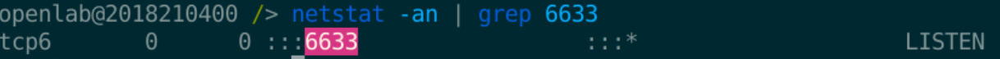

#### 2. 连接控制器

```shell
ovs-vsctl set-controller br-sw tcp:30.0.1.3:6633
```

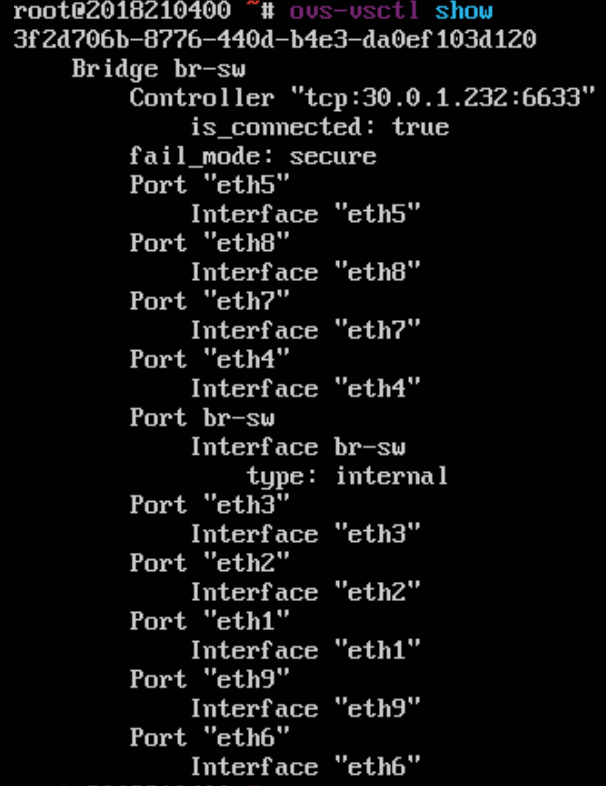

#### 3. 设置主机 IP

分别设置主机 1、主机 2、主机 3 的 IP 地址：

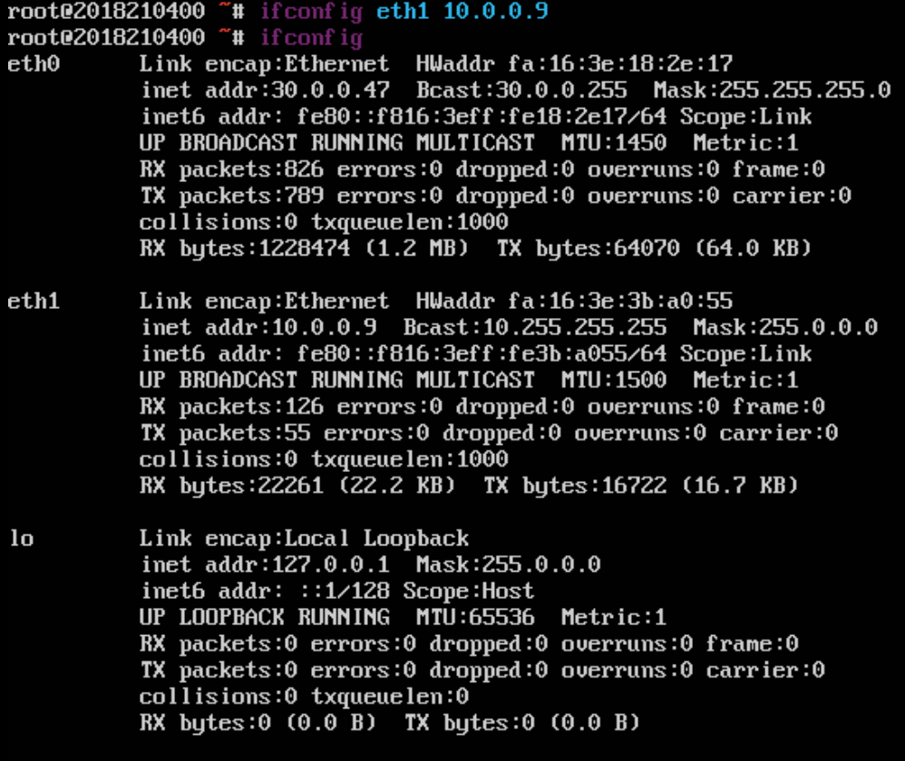
_host1_


_host3_

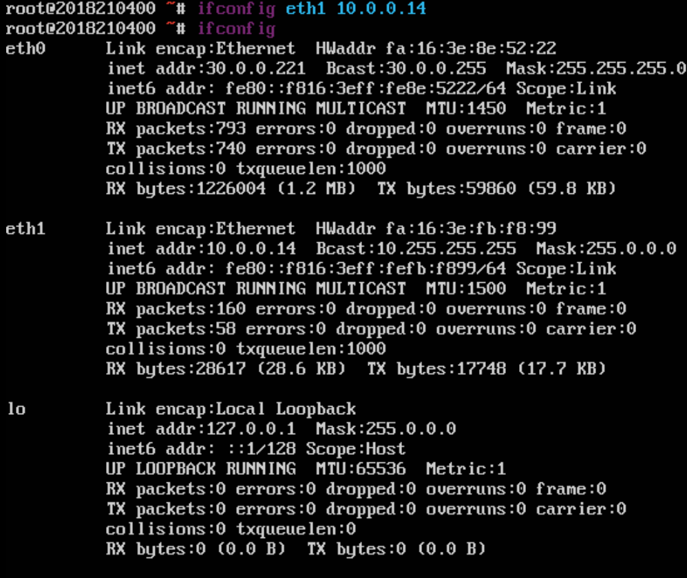
_host3_

### 二、基于 OpenFlow1.0 协议下发流表

#### 1. 设置协议版本

切换到交换机，执行以下命令设置 OpenFlow 协议版本为 1.0。

```shell
ovs-vsctl set bridge br-sw protocols=OpenFlow10
```

#### 2. 进入 Opendaylight Web UI

切换到控制器，在浏览器中进入 `http://127.0.0.1:8080/index.html`。

#### 3. 查看节点信息

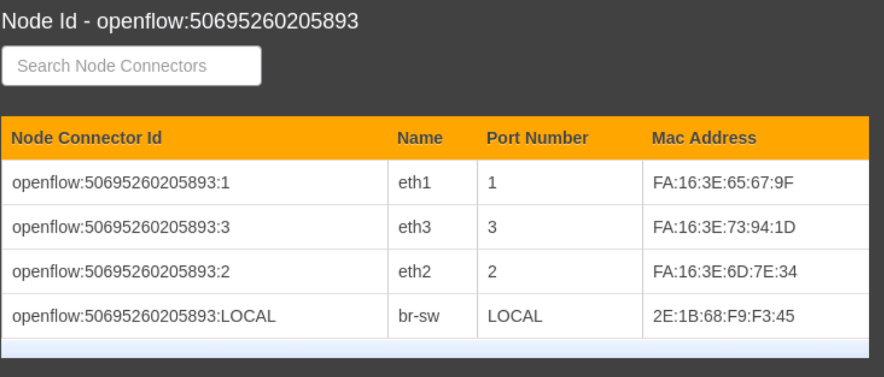

#### 4. 进入 Yang UI

选择左侧的 `Yang UI`，选择 `opendaylight-inventory rev.2013-08-19 -> config -> nodes -> node{id} -> table{id} -> flow{id}`，如下图所示。

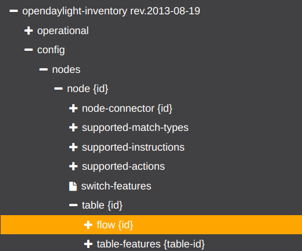

#### 5. 补全 path


#### 6. 设置以太网匹配

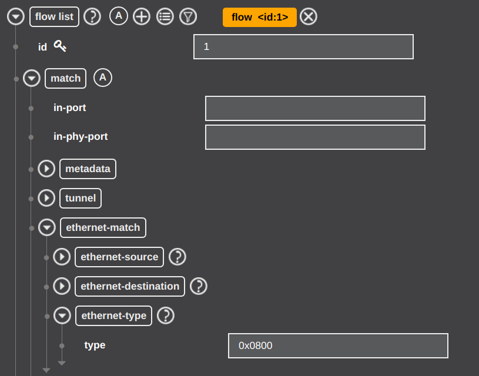

#### 7. 设置网络层匹配

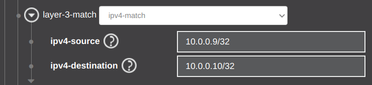

#### 8. 设置 instructions

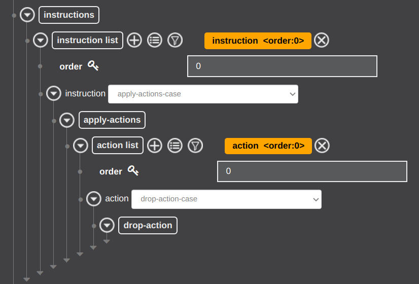

#### 9. 设置 priority、idle-timeout、hard-timeout、cookie 和 table_id

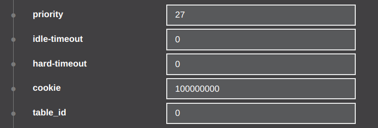

#### 10. 下发流表

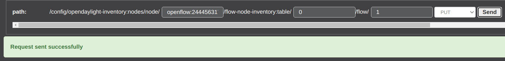

#### 11. 检查流表

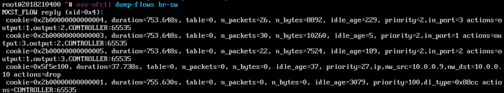

#### 12. 测试主机间的连通性

切换至主机 1，执行以下命令：

```shell
scapy

>>> result,unanswered=sr(IP(dst=”10.0.0.10”,ttl=(3,10))/ICMP())
>>> result,unanswered=sr(IP(dst=”10.0.0.14”,ttl=(3,10))/ICMP())
```

结果为

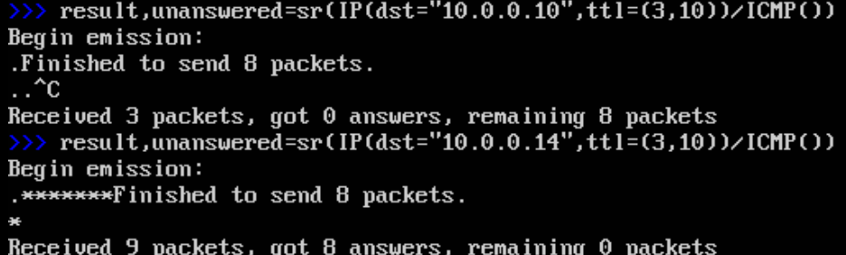

由上图可知，主机 1 与主机 2 之间不通，主机 1 与主机 3 通，新下发的流表项生效。

**说明：如果主机之间通则能够收到 answer，如果主机之间不通那么就无法收到 answer，当主机之间不通时 scapy 就会一直发送数据包，如果需要停止可以使用 Ctrl+c。**

#### 13. 删除流表

执行以下命令

```shell
ovs-ofctl del-flows br-sw dl_type=0x0800,nw_src=10.0.0.3,nw_dst=10.0.0.4
```

可以看到之前的下发的流表被删除了：

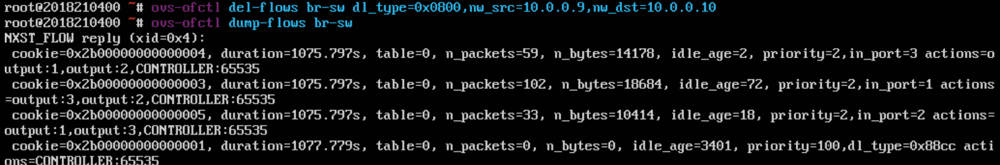

#### 14. 再次测试主机间的连通性

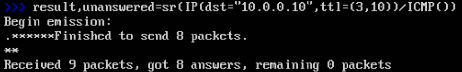

由上图可知，主机 1 与主机 2 ,主机 1 与主机 3 之间都可连通。

### 三、基于 OpenFlow1.3 协议下发流表

#### 1. 设置协议版本

切换到交换机，执行以下命令设置 OpenFlow 协议版本为 1.3。

```shell
ovs-vsctl set bridge br-sw protocols=OpenFlow13
```

#### 2. 进入 Yang UI

同 `二、4.`

#### 3. 补全 path

由于 OpenFlow1.3 协议支持多级流表，所以这里的 table id 设置为 2。


#### 4. 设置以太网匹配


#### 5. 设置网络层匹配

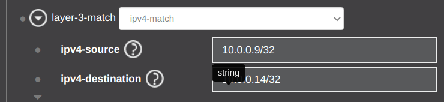

#### 6. 设置 instructions


#### 7. 设置 priority、idle-timeout、hard-timeout、cookie 和 table_id


#### 8. 下发流表

选择 `PUT` 方式，然后单击 `Send` 下发流表。

#### 9. 测试主机间的连通性

切换至主机 1，执行如下命令，向主机 3 发送数据包。

```shell
>>> result,unanswered=sr(IP(dst=”10.0.0.14”,ttl=(3,10))/ICMP())
```

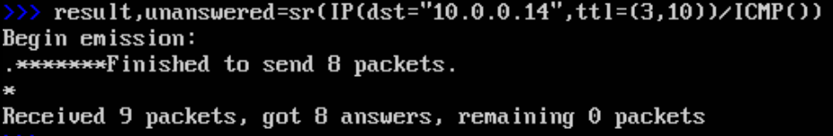

由上图可知，主机 1 与主机 3 之间是连通的，新下发的流表没有发挥作用。原因是数据包在 table 0 中能够匹配到相应流表就不会被转发到 table2，想要 table2 的流表项发挥作用就需要向 table0 增加一条流表，将源 IP 为 10.0.0.3，目的 IP 为 10.0.0.2 的数据包转发到 table2 中处理。

#### 10. 设置 table0 流表

将 table id 改为 0，重新设置 instructions，其他设置保持不变。

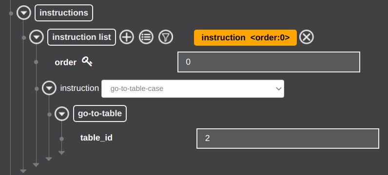

#### 11. 设置 priority、idle-timeout、hard-timeout、cookie 和 table_id


#### 12. 下发并检查流表

单击 `Send` 下发流表后切换至交换机，执行以下命令查看流表：

```shell
ovs-ofctl -O OpenFlow13 dump-flows br-sw
```

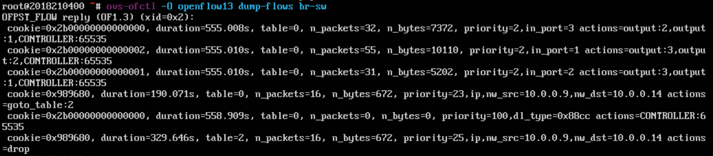

#### 13. 测试主机之间的连通性

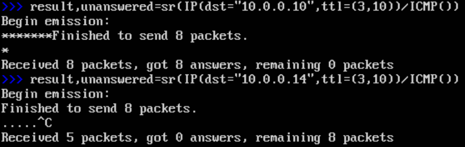

由上图可知，主机 1 与主机 3 之间不通，而主机 1 与主机 2 之间通，流表发挥作用。

### 四、自定义流表

设计流表项，使数据包只能按照主机 1=>主机 2=>主机 3 的方向发送。

对于以下 instructions


设置两种匹配

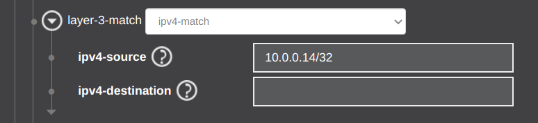

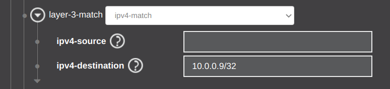

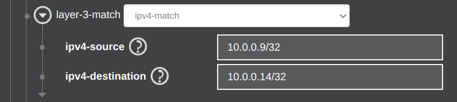

切换至交换机，检查流表：

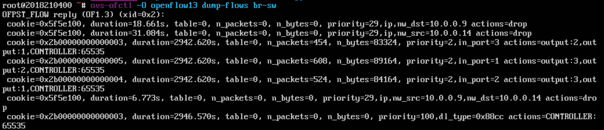

此时的流量分析为：

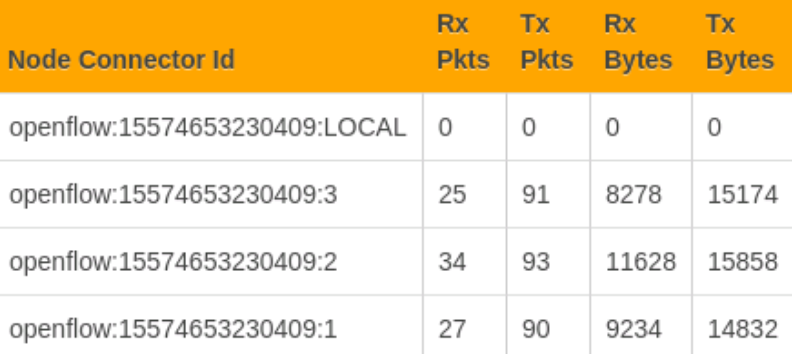

分别在 3 台主机上测试：

#### 主机 1

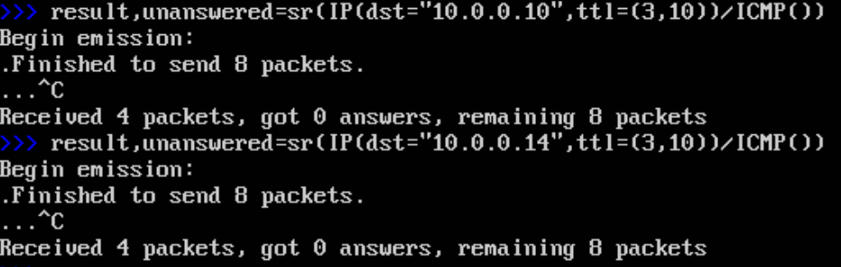
_host1_

因为数据只能单向发送，所以无法收到应答。

此时的流量分析为：

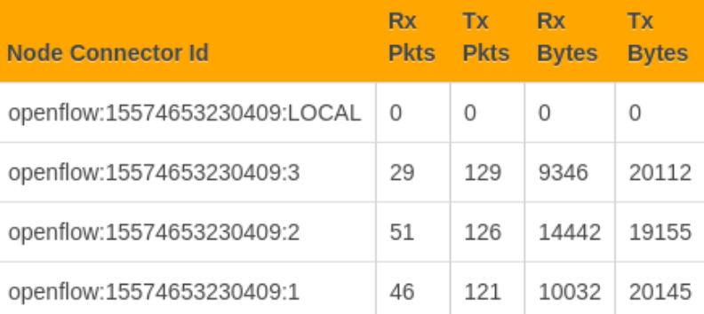

#### 主机 2

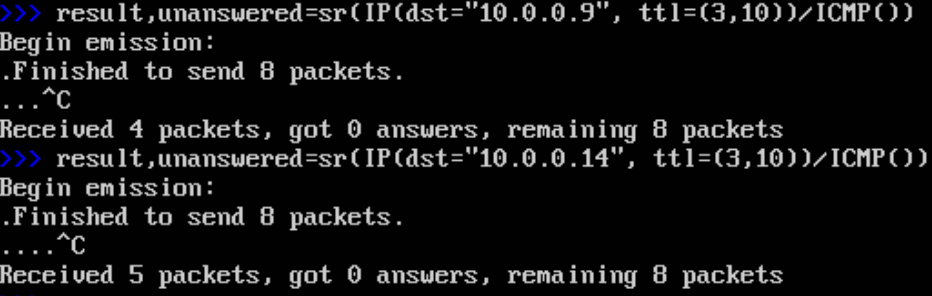
_host2_

此时的流量分析为：

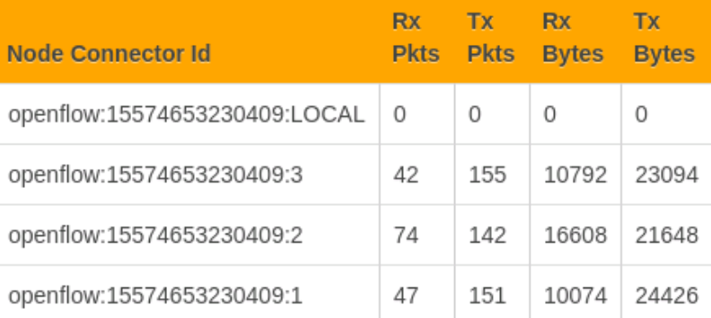

#### 主机 3


_host3_

此时的流量分析为：


综上，数据包只能按照主机 1=>主机 2=>主机 3 的方向发送。
